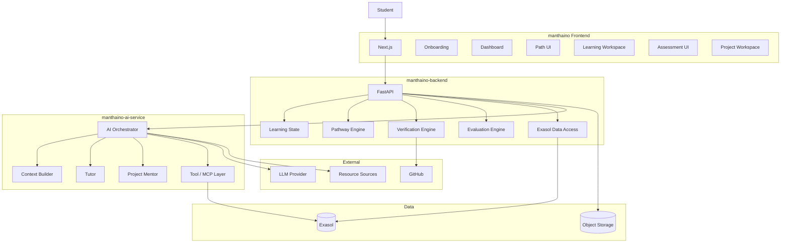
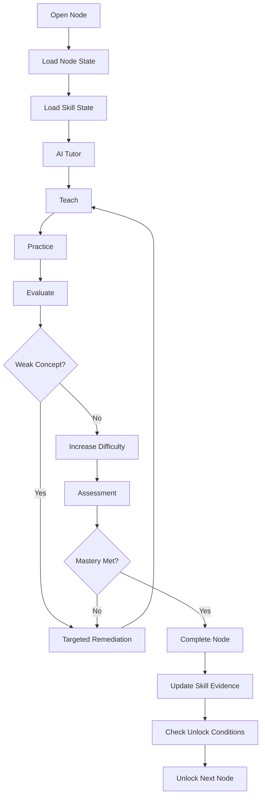
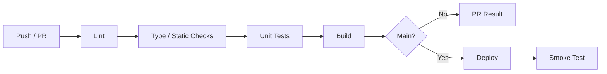

# manthaino — Antigravity Master Build Prompt

## Project identity

- **Application:** manthaino
- **Product phrase:** LEARN on ur phase
- **Technical identifier:** `manthaino`
- **Audience:** college/university students and recent graduates

Use `manthaino` in the UI. Use ASCII-safe `manthaino` / `learn-on-ur-phase` for URLs, package names, Docker names, environment variables and repositories.

## Build objective

Build manthaino as an adaptive AI learning platform, not a generic chatbot.

Core loop:

```text
GOAL → PROFILE → VERIFY → DIAGNOSE → PLAN → LEARN → PRACTICE
→ ASSESS → UPDATE PROFICIENCY → UNLOCK → REPLAN
```

Two major experiences:

1. Structured discovery: goal, profile, evidence, verification, skill gaps and pathway generation.
2. Persistent learning: every unlocked path node is a ChatGPT-like learning workspace with chat history, lessons, exercises, assessments, projects and proficiency state.

## GitHub organization and repositories

Create one GitHub organization:

`manthaino`

Recommended repositories:

```text
manthaino-frontend
manthaino-backend
manthaino-ai-service
manthaino-infra
manthaino-docs
```

### Responsibilities

**manthaino-frontend**
- Next.js + TypeScript
- onboarding
- dashboard
- path visualization
- assessment UI
- persistent learning workspace
- chat UI
- project workspace
- progress UI

**manthaino-backend**
- Python + FastAPI
- API contracts
- learner state
- business rules
- lock/unlock
- completion
- Exasol access
- pathway engine
- verification engine
- learning state

**manthaino-ai-service**
- LLM orchestration
- tutor
- pathway reasoning/explanation
- project mentor
- tool calling
- MCP where useful
- context builder
- structured AI output validation

**manthaino-infra**
- Docker
- CI/CD
- deployment
- environment templates
- health checks
- infrastructure configuration

**manthaino-docs**
- product specification
- architecture
- API contracts
- data dictionary
- ADRs
- demo script
- deployment documentation

## Technology stack

### Frontend
- Next.js
- TypeScript
- App Router
- Tailwind CSS
- shadcn/ui
- TanStack Query
- React Hook Form + Zod where useful

### Backend
- Python
- FastAPI
- Pydantic
- Exasol connectivity

### AI
- LLM API
- LangGraph OR native structured tool calling
- MCP for selected tool boundaries

Do not build an unnecessary multi-agent swarm.

### Data
- Exasol as the structured and analytical data foundation
- S3-compatible object storage for binary files

### DevOps
- Docker
- GitHub Actions
- CI on every repository
- CD from protected `main`
- health checks
- environment separation

## Architecture



## UI style

The UI must feel like an **AI learning operating system**, not a ChatGPT clone.

Use:
- premium education/productivity aesthetic
- neutral/off-white surfaces
- deep navy/near-black typography
- restrained blue/lavender accent
- thin borders
- rounded cards
- generous whitespace
- strong typography
- subtle gradients only where useful
- minimal motion

Avoid:
- cyberpunk/neon
- excessive glassmorphism
- AI sparkle decoration
- giant gradients
- excessive animations

Typography:
- UI: Inter / Geist
- technical values: JetBrains Mono / Geist Mono

Learning workspace:

```text
┌─────────────────────────────────────────────────────────────┐
│ manthaino                                     Python          │
├──────────────────┬──────────────────────────────────────────┤
│ YOUR PATH        │ Python                                   │
│                  │                                          │
│ ✓ Python         │ Continue Learning                        │
│ 🔓 SQL           │ Current module: Decorators               │
│ 🔒 Data Modeling │ Progress: 64%                            │
│ 🔒 Distributed   │                                          │
│ 🔒 Spark         │ ─────────────────────────────────────    │
│                  │                                          │
│ Progress         │ AI Tutor                                 │
│ ███████░░ 68%    │                                          │
│                  │ You: Explain decorators again.            │
│                  │                                          │
│                  │ manthaino:                                │
│                  │ ...                                      │
│                  │                                          │
│                  │ [ Ask about Python...                ↑ ] │
└──────────────────┴──────────────────────────────────────────┘
```

The pathway remains visible while learning.

## Data model

Implement at minimum:

```text
learners
goals
skills
learner_skills
career_roles
role_skills
courses
course_skills
course_prerequisites
projects
project_skills
path_instances
path_nodes
conversations
messages
assessments
assessment_results
evidence
learning_progress
exercise_results
project_evaluations
```

## Authority rules

The LLM can:
- reason
- explain
- choose tools
- tutor
- mentor
- summarize

The LLM cannot independently:
- complete a node
- unlock a node
- invent scores
- invent proficiency
- fabricate evidence
- change authoritative learner history

Backend + database are authoritative for progression.

## Proficiency

Internal score:

```text
0.00–0.19 None
0.20–0.39 Beginner
0.40–0.59 Basic
0.60–0.74 Intermediate
0.75–0.89 Advanced
0.90–1.00 Expert
```

Store:
- proficiency
- confidence
- evidence sources
- assessment history
- timestamp

Self-reported proficiency is never ground truth.

## Verification

Combine:

```text
Self claim
+ adaptive assessment
+ practical task
+ existing evidence
+ coursework where available
```

Initial scoring can be:

```text
0.45 × Assessment
+ 0.25 × Practical
+ 0.15 × Evidence
+ 0.15 × Coursework
```

Verify only high-impact skills for the chosen goal.

## Pathway

The route is generated from the graph, not hardcoded.

Example:

```text
Python
→ SQL
→ Data Modeling
→ Distributed Systems
→ Big Data
→ Spark
→ Cloud Data Engineering
→ Capstone
```

Score candidate paths using:
- skill-gap reduction
- career relevance
- prerequisite validity
- time efficiency
- difficulty fit

Initial weights:

```text
0.35 gap reduction
0.25 career relevance
0.15 prerequisite validity
0.15 time efficiency
0.10 difficulty fit
```

## Persistent learning node

Every node has:

```text
Overview
Lessons
Concepts
Exercises
Assessment
Project
Chat
History
Proficiency
```

Restore on return:
- current module
- current concept
- progress
- mastery
- weak concepts
- unresolved exercises
- conversation history/summary
- last activity
- next action

## Lock/unlock

Statuses:

```text
LOCKED
UNLOCKED
IN_PROGRESS
ASSESSMENT_READY
REMEDIATION
COMPLETED
REVIEW
```

A node unlocks only when mandatory prerequisites and proficiency thresholds are satisfied.

## Completion

Example:

```text
Lessons = 100%
Exercises >= 80%
Assessment >= 80%
Practical = PASS
```

Only backend business logic can transition a node to `COMPLETED`.

## Learning loop



## Agent tools

Implement:

```text
get_learner_profile()
get_current_skill_state()
get_target_requirements()
calculate_skill_gaps()
get_prerequisites()
find_courses_for_skill()
find_projects_for_skills()
generate_candidate_paths()
rank_candidate_paths()
get_learning_node_state()
get_conversation_context()
get_weak_concepts()
record_assessment_result()
update_skill_evidence()
check_unlock_conditions()
complete_learning_node()
```

## MCP

Use MCP for meaningful tool boundaries where it improves the demonstration. Do not force every internal function through MCP.

## Conversation

Store per learning node:

```text
conversation_id
learner_id
path_node_id
title
summary
created_at
updated_at
```

Messages:

```text
message_id
conversation_id
role
content
metadata
created_at
```

Use recent messages + summary + structured state rather than sending the entire lifetime transcript every turn.

## API

Minimum:

```text
POST /goals
GET  /goals/{goal_id}

GET  /learners/{id}/profile
POST /learners/{id}/skills
POST /learners/{id}/evidence

POST /assessments/start
POST /assessments/{id}/answer
GET  /assessments/{id}/result

POST /paths/generate
GET  /paths/{id}
POST /paths/{id}/regenerate

GET  /nodes/{id}
POST /nodes/{id}/start
GET  /nodes/{id}/progress
POST /nodes/{id}/complete

GET  /conversations/{id}
POST /conversations/{id}/messages

GET  /projects/{id}
POST /projects/{id}/submit
POST /projects/{id}/review
```

## CI/CD

Every repository must have GitHub Actions.

Pipeline:



Frontend:
```text
npm ci
lint
typecheck
test
build
```

Python services:
```text
install
ruff
format check
mypy
pytest
build
```

AI service additionally:
```text
tool contract tests
structured output tests
agent tests
```

Infrastructure:
```text
configuration validation
Docker validation
```

CD:
```text
protected main
→ CI
→ build image
→ publish artifact
→ deploy
→ health check
→ smoke test
```

## Docker

Provide Dockerfiles for:
- frontend
- backend
- ai-service

Provide local integration compose configuration where practical.

## Environment

Provide `.env.example`.

Use environment variables for:
- API URLs
- Exasol credentials
- LLM key/model
- object storage
- optional GitHub integration

Never commit secrets.

## Documentation

Every repository:

```text
README.md
CONTRIBUTING.md
LICENSE
.env.example
```

Docs repository:

```text
architecture.md
product-flow.md
data-model.md
api.md
deployment.md
security.md
demo-script.md
adr/
```

## Future implementation — do not block MVP

Keep architecture extensible for:

```text
Resume ingestion
GitHub deep analysis
LinkedIn integration
Certification mapping
Job matching
Multi-goal optimization
Advanced cohort analytics
Large-scale web scraping
Mobile app
Advanced semantic retrieval
Multi-agent swarm
Social learning
```

## Four-day phases

### PHASE 0 — Organization and repository foundation
Create organization and five repositories. Add README, license, contribution guide, CODEOWNERS, PR/issue templates, `.env.example`, CI, protected main, naming conventions and API contract.

Done when all repositories clone, install, lint, test and build.

### PHASE 1 — Exasol data foundation
Create schema, seed 5 strong career paths, 40–60 skills, 50–70 courses/nodes, 100+ prerequisites, 150+ course-skill mappings, projects and role-skill mappings. Implement skill-gap, prerequisite, coverage, candidate-path and scoring queries.

Done when Exasol can produce a meaningful candidate pathway without an LLM.

### PHASE 2 — Backend core
Build FastAPI, Pydantic models, Exasol data-access layer, APIs, centralized state transitions, completion rules, lock/unlock rules, health endpoint and tests.

Done when the non-AI product flow works.

### PHASE 3 — AI service
Build orchestrator, tools, context builder, tutor mode, pathway explanation, project mentor, structured outputs, tool failure handling and useful MCP boundaries.

Done when the agent investigates actual data through tools.

### PHASE 4 — Frontend
Build Next.js shell, onboarding, goal/profile, dashboard, path visualization, node states, skill profile, assessment UI and learning workspace.

Done when the complete product shell works against mock/API data.

### PHASE 5 — Verification
Build adaptive assessment, practical tasks, scoring, confidence, evidence records and discrepancy handling.

Done when claimed and verified proficiency can differ.

### PHASE 6 — Persistent learning workspace
Build streaming chat, node-specific memory, lessons, exercises, remediation, assessment and persistent return-to-session behavior.

Done when a learner can leave Python and later resume exactly where they stopped.

### PHASE 7 — Completion and unlock
Implement mastery rules, node completion, skill update, unlock condition and lock explanation.

Done when Python completion automatically unlocks the next eligible node.

### PHASE 8 — Projects
Build requirements, tasks, AI mentor, submission, evaluation and skill evidence.

Done when a project contributes evidence to the learner profile.

### PHASE 9 — Adaptive path
Update proficiency, recalculate gaps, rerank remaining path and explain path changes.

Done when new evidence can change the remaining route without corrupting history.

### PHASE 10 — Release
Feature freeze, CI/CD, Docker builds, deployment, smoke tests, README, architecture, demo, screenshots and submission.

## Execution rule

Work phase-by-phase but develop independent repositories in parallel.

Do not wait for every repository to finish before starting the next.

Use mocked API contracts where necessary.

Never introduce a new database, agent swarm, framework or major integration unless it solves a current phase requirement.

## Final acceptance test

```text
Open manthaino
→ choose Data Engineer
→ enter claimed skills
→ verify skills
→ see verified proficiency
→ see gaps
→ generate path
→ open Python
→ chat with tutor
→ practice
→ assessment
→ pass
→ Python COMPLETE
→ next node UNLOCKED
→ return to Python
→ old conversation restored
→ skill profile updated
→ path recalculated if required
```

The product is successful when this journey is reliable end-to-end.
